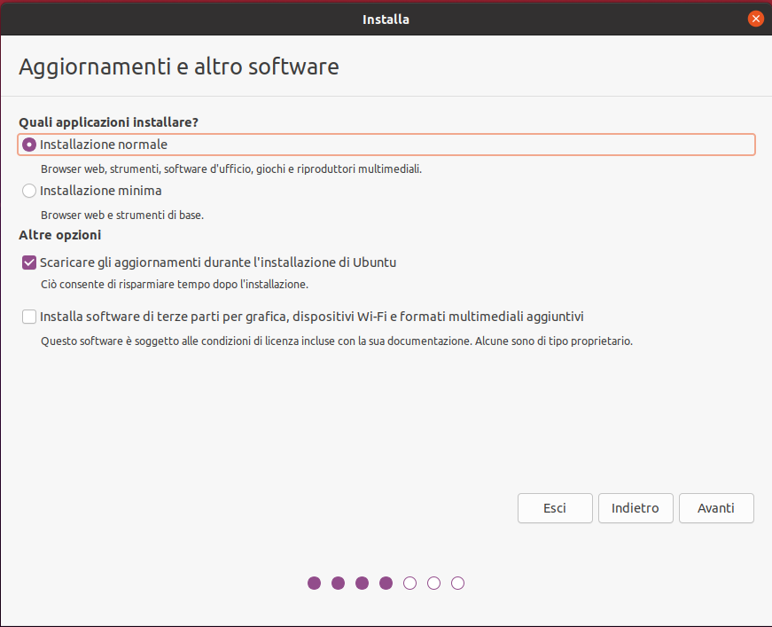
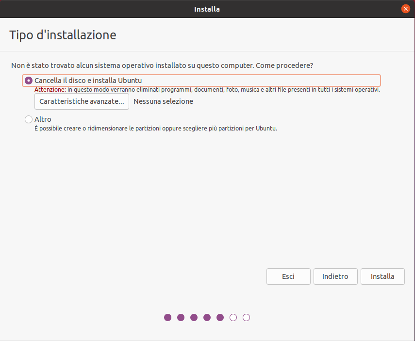
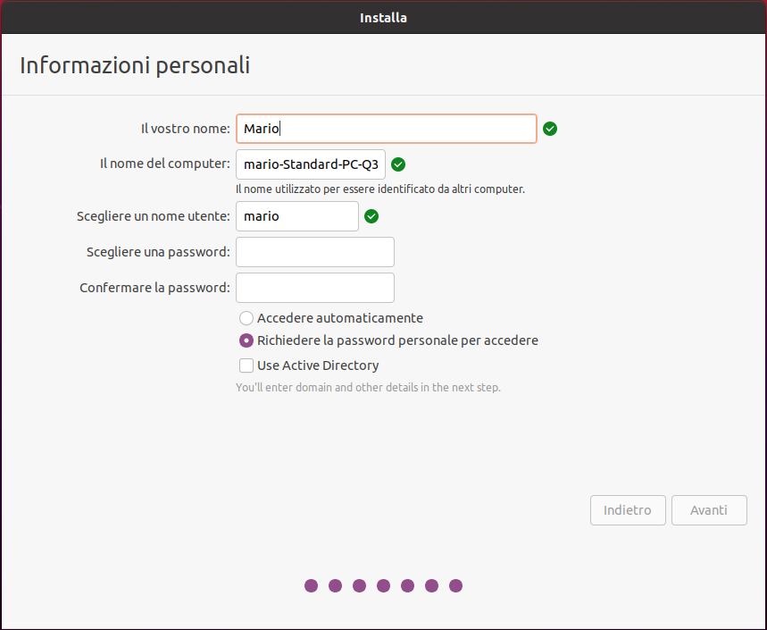

  
    LINUX
   

---
layout: image-header-intro
imageRight: '/static/linux.png'
---
  

    
      Cos'è Linux
    
  

  

    
      Linux è un sistema operativo <strong>Unix Like</strong>, ideato da Linus Torvlads nel 1991.
    
  

  

    
      Linux è una reale alternativa al mondo Microsoft e Unix, presente in milioni di dispositivi e server, utilizzato 
      da migliaia di sviluppatori in un mercato in continua espansione.
    
  

  

    
      Linux è oggi utilizzato in sistemi integrati, per il controllo di dispositivi robotici e sullo shuttle: 
      praticamente gira su oggetti elettronici di tutti i tipi, dai server agli smartphone, risultando il sistema
      operativo in assoluto più utilizzato.
    
  

  

    
      Con Linux viene gestita la maggior parte di Internet, le più grandi piazze finanziarie del mondo, nonchè i 
      supercomputer che permettono le scoperte scientifiche.
    
  

---
layout: dynamic-image
image: 'static/Linus_Torvalds.jpg'
equals: false
---

  
    Accenni di Storia
  

  
    Linus Torvalds e la nascita di Linux
  

  
    Linus Torvalds, studente finlandese di informatica, il 25 agosto del 1991, insoddisfatto del sistema operativo 
    Minix (sistema unix-like destinato alla didattica e che mal supportava la nuova architettura i386 a 32bit), decide 
    di creare un kernel unix con lo scopo di divertirsi e studiare il funzionamento del suo computer, un 80386.
  

  
    All'inizio, il kernel programmato da Linus, chiamato Linux, aveva la necessità di girare all'interno dello 
    userspace di Minix. Questo implicava l'adesione alla licenza del Minix stesso, ovvero il libero utilizzo
    esclusivamente a fini didattici, impedendone la libera distribuzione.
    Linus decide quindi di sostituire quella parte del sistema operativo con il software del progetto GNU. Per fare ciò,
    Torvalds, cambiò la licenza e adottò la GPL.
  

  
    Sin dalla versione 0.01 si poteva compilare e far partire la shell GNU Bash. Linus rende pubblico il suo lavoro ed
    il suo codice, trovando presto altri sviluppatori che aderiscono alla visione ed al progetto, rendendo in breve
    tempo linux un sistema operativo completo, pienamente funzionante e libero. Il 12 marzo del 1994, Linus Torvalds
    presenta all'Università di Helsinki la prima versione stabile di Linux, la 1.0.
  

---
layout: image-header-intro
imageRight: '/static/gnu.png'
---
  

    
      Gnu Public License
    
  

  

    
      Linus Torvalds racconta nel suo libro, che linux nasce per poter dare un'alternativa libera al predominio dei 
      software propretari. Adotta quindi una licenza il cui scopo principale è mantenere tale libertà. 
    
  

  

    
      La <strong>GPL</strong> sancisce che qualiasi fornitore, al momento di distribuire file binari, deve anche rendere
      il codice sorgente leggibile e disponibile sotto gli stessi termini di licenza. 
      Essa garantisce agli utenti finali, come organizzazioni, imprese o semplici individui, di utilizzare, condividere 
      e persino modificare il software.
    
  

  

    
      Oggi arrivata alla terza versione, è progettata per essere applicata facilmente ai programmi di cui si detengono i
      relativi diritti.
    
  

---
layout: center-image
equals: false
---

  
    Ma cos'è nella pratica
  

  

      Possiamo definirlo, impropriamente, un sistema operativo che, come i suoi principali competitor, Windows e Mac OSX,
      permette al software applicativo di dialogare con l'hardware e gestirne le risorse. 
      Senza il sistema operativo, il software non potrebbe funzionare.
  

  

      Il Sistema Operativo è composto da un certo numero di sottosistemi:
    <ul class="ml-3 pt-2">
      <li>- il <strong>Bootloader</strong>, che è il software che gestisce il processo di avvio del computer;</li>
      <li>
        - il <strong>Kernel</strong>, che è il cuore del sistema e si occupa di gestire le risorse presenti nel
        computer, rendendole disponibili alle applicazioni;
      </li>
      <li>
        - i <strong>Demoni</strong>, che sono i vari servizi che ascoltano in backgroud e si attivano all'avvio del
        computer o in seguito a specifici eventi;
      </li>
      <li>
        - la <strong>Shell</strong>, ovvero un software che emula un terminale a caratteri che permette di
        controllare il computer;
      </li>
      <li>
        - il <strong>Server Grafico</strong>, a cui è delegata la responsabilità di visualizzare le informazioni sul 
        monitor;
      </li>
      <li>
        - l'<strong>Ambiente Desktop</strong>, ovvero il sottosistema con cui l'utente interagisce con il sistema 
        operativo.
      </li>
    </ul>
  

---
layout: center-image
equals: false
---

  
    Le Distribuzioni
  

  

      Una distribuzione è un confezionamento di vari pacchetti software coerenti fra loro, atto a rendere comoda e
      semplice, tramite procedure guidate, l'installazione di linux.
  

  

    Tenendo a mente che:
    <ul class="ml-3 pt-2">
      <li>- linux è solo un kernel, non un vero e proprio sistema operativo;</li>
      <li>
        - le applicazioni eseguite all'interno della user-space hanno una propria versione e sono indipendenti da linux
        stesso;
      </li>
    </ul>
  

  

    possiamo sicuramente affermare che le distribuzioni aggiungono tutto il software necessario per avere un sistema 
    operativo completo di software applicativi e di servizio, personalizzando le versioni degli stessi e organizzando al
    meglio la procedura di installazione.
  

---
layout: center-image
equals: false
---

  
    Quale distribuzione utilizzeremo
  

  

      Le distribuzioni oggi disponibili sono diverse decine, tutte valide a modo loro e che si differenziano tra esse
      per delle pecularietà come l'ambiente di lavoro a cui sono destinate.
  

  

    In questo corso utilizzeremo <strong>Ubuntu 20.04 LTS</strong>, una delle distribuzioni più semplici da usare che, grazie
    proprio alla semplicità di utilizzo, risulta essere la più diffusa.
  

  

    Ubuntu nasce il 20 ottobre 2002 con l'obiettivo principale di portare linux alle masse. È una distribuzione
    fortemente pensata per essere efficiente ma allo stesso tempo semplice da utilizzare.
  

  

    Di proprietà di Canonical, Ubuntu si presta ad essere usata sia su workstation, che su server e infrastrutture 
    cloud. 
    Proprio da questi ultimi due settori, Canonical trae i propri profitti.
  

---
layout: image-header-intro
imageRight: 'static/Installazione01.png'
---

  
    Installazione
  

  

      L'installazione avverrà tramite una procedura guidata, durante la quale ci verranno poste alcune domande.
  

  

    Attenzione La procedura di installazione apporterà modifiche
    alla memoria del computer, riducendo lo spazio disponibile del sistema operativo già presente, se si intende
    mantenerlo, piuttosto che eliminando tutti i dati presenti in esso se si intende sosituirlo. 
    È quindi necessario prestare la dovuta attenzione prima di procedere e assicurarsi di avere una copia di backup dei
    propri dati.
  

---
layout: center-image
---

  
    Installazione
  

  

    
    

      Decidiamo se procedere con un'installazione minimale o completa e, soprattutto, se scaricare gli aggiornamenti
      durante l'installazione ed installare driver e software di terze parti.
    

  

  

    
    

      Decidiamo se cancellare il contenuto del disco o ricavare un po di spazio da quello libero.
    

  

  

    
    

      Inseriamo il nome utente che desideriamo utilizzare, il nome con cui il computer sarà riconosciuto all'interno 
      della rete e la password
    

  

---
layout: image-header-intro
imageRight: 'static/Desktop.jpg'
---

  
    Primo Avvio
  

  

    Terminata l'installazione, ci troveremo dinanzi una schermata di accesso con evidenziato il nome utente che 
    abbiamo scelto nella fase precedente. 
    Cliccandoci sopra, ci verrà richiesta la password (anch'essa scelta nella fase precedente) e ci troveremo
    nell'ambiente desktop predefinito di Ubuntu
  

---
layout: center-image
equals: false
---

  
    Il File System
  

  

    Il file system è un sistema di archiviazione su un supporto di memoria che struttura e organizza in modo specifico 
    scrittura, ricerca, lettura, memorizzazione, modifica ed eliminazione dei file. La strutturazione dei file deve 
    garantire una loro identificazione rapida senza errori e un accesso il più veloce possibile da parte degli utenti. 
    Inoltre, il file system definisce, ad esempio, le seguenti proprietà:
    <ul class="ml-3">
      <li>- convenzioni sui nomi di file</li>
      <li>- attributi dei file</li>
      <li>- controllo/i di accesso</li>
    </ul>
    Inoltre il file system è un’importante componente operativa che funge da interfaccia tra il sistema operativo e 
    tutte le unità collegate interne ed esterne, ad esempio tramite una porta USB.
  

---
layout: center-image
equals: false
---

  
    Il File System su Linux
  

  

    

      

        

          L'organizzazione del file system di Linux è gerarchica: tutto inizia da una singola directory, non esiste 
          distinzione tra hardware e software (le periferiche hardware in Linux vengono rappresentate come dei file 
          speciali) e qualsiasi parte del sistema è figlia della directory radice. 
          In parole povere, tutto inizia dalla directory root e tutto termina con essa.
        

        

          La directory <code>/</code> è accessibile digitando <code>cd /</code> da terminale, oppure scrivendo 
          <code>/</code> nella barra degli
          indirizzi del file manaager.
        

      

      

        / (directory root) 
        |_ /boot 
        |_ /dev 
        |_ /etc 
        |_ /home 
        |_ /lib 
        |_ /llib64 
        |_ /mnt 
        |_ /opt 
        |_ /proc 
        |_ /root 
        |_ /run 
        |_ /sys 
        |_ /tmp 
        |_ /usr 
        |_ /var 
      

    

  

  

---
layout: center-image
equals: false
---

  
    Il File System su Linux
  

  

    La directory <code>/boot</code> contiene tutti i file relativi all'avvio del sistema.
  

  

    La directory <code>/dev</code> contiene dei file di tipo particolare che rappresentano i <code>devices</code>
    presenti e riconosciuti nella macchina;
  

  

    La directory <code>/etc</code> contiene tutti i file di configurazione del sistema;
  

  

    La directory <code>/home</code> contiene tutte le "home directory" degli utenti;
  

  

    Le directory <code>/lib</code> e <code>/lib64</code> contengono le librerie di sistema, rispettivamente a 32 ed a 
    64bit;
  

  

    La directory <code>/mnt</code> è vuota e rimane a disposizione dell'utente per montarvi manualmente i devices
    che vengono collegati alla macchina;
  

  

    La directory <code>/opt</code> contiene tutte le applicazioni installate dall'utente che risultano essere
    opzionali, non facenti parte del sistema e spesso non gestiti dal package manager utilizzato dal sistema;
  

---
layout: center-image
equals: false
---

  
    Il File System su Linux
  

  

    La directory <code>/proc</code> è una directory particolare: ogni processo in esecuzione in Linux, occupa delle
    risorse di sistema. Per gestire tali processi, il sistema utilizza una sorta di file system che non prende
    spazio sulla memoria di massa ma è totalmente caricato in RAM. Questo file system prende posto all'interno
    della directory <code>/proc</code>. Navigando all'interno della cartella, si scopriranno tante directory
    quanti sono i processi in esecuzione sul sistema (alcuni nomi corrisponderanno ai nomi dei processi, altri al
    pid assegnato per l'esecuzione);
  

  

    La directory <code>/root</code> è la home directory dell'utente root;
  

  

    La directory <code>/run</code> è utilizzata dalle applicazione per salvare tutto ciò che gli occorre per poter
    operare, come le informazioni sui socket, i file di lock e altre informazioni utili solamente a runtime;
  

  

    La directory <code>/sys</code> è un file system virtuale dove il kernel esporta le proprie informazioni per 
    renderle disponibili ad altri programmi;
  

  

    La directory <code>/tmp</code> è dove tutti i programmi possono scrivere i file temporanei;
  

---
layout: center-image
equals: false
---

  
    Il File System su Linux
  

  

    La directory <code>/usr</code> contiene file relativi alle applicazioni e al kernel
    <ul>
      <li>- in <code>/usr/bin</code> in genere sono presenti i file binari utilizzabili dai normali utenti;</li>
      <li>- in <code>/usr/lib</code> sono presenti le librerie per il funzionamento dei programmi installati;</li>
      <li>- in <code>/usr/include</code> sono presenti gli header delle librerie, utili per la compilazione
      dei programmi;</li>
      <li>- in <code>/usr/share</code>sono presenti i dati relativi alle varie applicazione, tra cui le pagine
      dei manuali;</li>
      <li>- in <code>/usr/sbin</code> in genere sono presenti i file binari utilizzabili solo da root;</li>
      <li>- in <code>/usr/local</code> spesso troviamo una struttura del tutto simile a <code>/usr</code>, al cui
      interno trovano posto le applicazioni compilate manualmente dall'utente finale.</li>
    </ul>
  

  

    Tutti gli eseguibili presenti in <code>/usr/bin</code>, <code>/usr/local/bin</code> o <code>/usr/sbin</code>,
    sono eseguibili da terminale senza specificarne il percorso. 
    La directory <code>/usr</code>, e tutte le sue sottodirectory, sono accessibili da tutti, ma modificabili soltanto
    dall'utente root.
  

  

    La directory <code>/var</code> contiene i dati che i programmi cambiano durante la normale esecuzione del sistema.
  

---
layout: center-image
equals: false
---

  
    Il File System su Linux
  

  

    Tramite il comando <strong>stat /</strong>, otteniamo:
  

  

    <code>
      File: / 
      Dim.: 4096        Blocchi: 8          Blocco di IO: 4096   directory 
      Device: fc05h/64517d  Inode: 2           Coll.: 20 
      Accesso: (0755/drwxr-xr-x)  Uid: (    0/    root)   Gid: (    0/    root) 
    </code>
  

  

    Le prime due righe indicano che la directory si chiama /, è grande 4096 bytes (come ogni directory) e
    occupa 8 blocchi. 
    Nella terza troviamo il device in cui risiede e il numero di ulteriori directory che contiene. 
    Nell'ultima riga sono presenti i permessi, l'utente e il gruppo a cui appartiene.
  

---
layout: center-image
equals: false
---

  
    Il File System su Linux
  

  

    I permessi associati alla root sono <strong>drwxr-xr-x</strong>, dove:
    <ul>
      <li>- la <strong>d</strong> sta per directory;</li>
      <li>- il primo gruppo di tre caratteri <strong>rwx</strong> indica i permessi di cui gode il proprietario;</li>
      <li>- il secondo gruppo, <strong>r-x</strong>, indica i permessi di cui gode il gruppo;</li>
      <li>- l'ultimo gruppo, <strong>r-x</strong>, i permessi di cui gode qualunque altro utente.</li>
    </ul>
  

  

    I permessi <strong>r</strong>, <strong>w</strong> e <strong>x</strong>, indicano rispettivamente: 
    <ul>
      <li><strong>r</strong> - diritto di lettura</li>
      <li><strong>w</strong> - diritto di scrittura</li>
      <li><strong>x</strong> - diritto di esecuzione</li>
    </ul>
  

  

    Il proprietario di <code>/</code> è l'utente con identificativo 0, quindi root, e il gruppo proprietario è il 
    gruppo 0, ovvero il gruppo root.
  

---
layout: center-image
equals: false
---

  
    File System - Links
  

  

    Le informazioni riguardanti un oggetto (file o directory) di un filesystem, sono contenute in un inode, che viene
    identificato da un numero progressivo e descrive le caratteristiche base di un oggetto: permessi, data di modifica,
    tipo, posizione, ecc.
  

  

    Il comando <code>ln <i>sorgente</i> <i>destinazione</i></code> crea un link (alias) di un file o di una directory
  

  

    Quando si opera sul link è come se si operasse direttametne sul file, tranne quando si rimuove il link, ovvero non
    si elimina il file.
  

  

    I link possono essere di due tipi: <strong>hard</strong> e <strong>soft</strong>:
    <ul class="ml-3">
      <li>- gli hard link sono di fatto un altro nome per un file esistente; originale e link sono indistinguibili, 
      condividono lo stesso inode e non possono risiedere su due file system diversi o far riferimento a directory;</li>
      <li>- i soft link, creabili con l'opzione <code>-s</code>, sono un tipo speciale di file che fanno riferimento a
      un inode diverso, può essere fatto su file system diversi e su file che non esistono;</li>
    </ul>
  

  

    L'uso di link è completamente transparente e non impatta sulle performance del sistema.
  

---
layout: center-image
equals: false
---

  
    File System - Gestione
  

  

    Prima di poter utilizzare un filesystem (ad es. CDROM, USB, condivisione di rete windows, directory nfs), questo 
    deve essere formattato e montato in una sotto-directory della root ( / ).
  

  

    Una volta montato, il file system risulta accessibile a programmi ed utenti in maniera totalmente trasparente,
    diventando parte integrante dell'albero delle directory sotto /.
  

  

    Dopo l'uso, il file system può essere smontato, operazione necessaria per le unità di memorizzazione removibili.
  

  

    La directory in cui viene montato un file system può anche non essere vuota ma, il suo contenuto non potrà essere
    visibile sino a quando non si smonta il file system
  

---
layout: center-image
equals: false
---

  
    File System - Gestione - Comandi
  

  

    <code>mount -t [tipo fs] [opzioni] <i>device</i> <i>destinazione</i></code> Monta un dispositivo a blocchi nella 
    directory di destinazione
  

  

    <code>umount [opzioni] <i>device</i></code> Smonta un dispositivo
  

  

    <code>df [opzioni] <i>file</i></code> Verifica lo spazio libero su disco
  

  

    <code>du [opzioni] <i>file</i></code> Verifica lo spazio occupato da file e directory
  

  

    <code>fsck [opzioni] <i>device</i></code> Verifica l'integrità e ripara il file system
  

  

    <code>mkfs [opzioni] <i>device</i></code> Crea un file system, ovvero lo formatta
  

  

    Nel file <code>/ect/fstab</code> vengono configurate le informazioni sui vari file system preimpostati sul sistema,
    impostandone i punti di mount, il tipo e altri utili parametri
  

---
layout: center-image
equals: false
---

  
    File System - Gestione - Comandi
  

  

    <code>chown [opzioni] [utente] <i>file</i></code> Assegna un nuovo utente proprietario, sia spefificandone il nome
    piuttosto che l'UID
  

  

    <code>chgrp [opzioni] [gruppo] <i>file</i></code> Assegna un nuovo gruppo proprietario, similmente a quanto avviene
    per il comando precedente
  

  

    <code>chmod [opzioni] [modo] <i>file</i></code> Modifica i permessi sul file, sia usando l'octal mode, dove si usano
    tre numeri, riferiti rispettivamente a owner, group e others, sia utilizzando il symbolic mode, dove si usano le 
    lettere r (read), w (write), x (execute) per assegnare i permessi a u (user), g (group) e o (others). 
    I seguenti comandi sono equivalenti: 
    <code> 
      chmod 755 nomefile 
      chmod u=rwx,go=rx nomefile
    </code>
  

---
layout: center-image
equals: false
---

  
    File System - Copia/Modifica file e directory
  

  

    <code>cp [opzioni] <i>sorgente</i> <i>destinazione</i></code> Copia di file o directory
  

  

    <code>mv [opzioni] <i>sorgente</i> <i>destinazione</i></code> Spostamento di file o directory
  

  

    <code>rm [opzioni] <i>file</i></code> Rimozione di file o directory
  

  

    <code>ls [opzioni] <i>path</i></code> Elenca contenuto di una directory
  

  

    <code>tree [opzioni] <i>path</i></code> Elenca contenuto di una directory con visualizzazione ad albero
  

  

    <code>cd <i>path</i></code> Cambia directory corrente
  

  

    <code>mkdir [opzioni] <i>directory</i></code> Crea una directory
  

  

    <code>rmdir [opzioni] <i>directory</i></code> Elimina una directory
  

---
layout: center-image
equals: false
---

  
    Multiutenza e Permessi
  

  

    Linux è un sistema operativo multiutente, dove differenti utenti possono avere accesso al sistema in modo
    contemporaneo, avendo i propri dati, i propri programmi e impostazioni. 
    L'operazione di autenticazione dell'utente avviene tramite nome utente e password e il login può essere eseguito
    in ambienti diversi, grafici o testuali, da locale o da remoto 
    L'utente principale del sistema è l'utente <strong>root</strong>, amministratore del sistema, con tutti i 
    poteri che comporta questo ruolo. Ha poteri assoluti sul sistema:
    <ul class="pl-5">
      <li>- Aggiungere, eliminare e modificare account</li>
      <li>- Installare e configurare servizi</li>
      <li>- Accesso completo a tutti i file presenti nel file system</li>
      <li>- Aggiungere o modificare file system</li>
      <li>- Distruggere tutto con un solo comando (il potere di root sul sistema è assolluto)</li>
    </ul>
  

---
layout: center-image
equals: false
---

  
    Multiutenza e Permessi
  

  

    Buona parte delle distribuzioni moderne, hanno deciso di disattivare in modo predefinito l'account di 
    amministrazione, incoraggiando l'utente ad utilizzare lo strumento <code>sudo</code> per svolgere i compiti di
    amministrazione di sistema.
  

  

    Lo strumento <code>sudo</code> permette a un utente (autorizzato) di elevare temporaneamente i propdi privilegi
    usando la propria password. Per poterlo fare, l'utente deve appartenere al gruppo admin ed essere aggiunto al
    file <code>/etc/sudoers</code>.
  

  

    Se per qualche motivo si rende necessario abilitare l'account di root, basterà assegnargli semplicemente una
    password con il comando <strong>sudo passwd</strong>
  

  

    In modo predefinito, l'utente iniziale creato durante l'installazione di Ubuntu è un membro del gruppo <code>
    admin</code> ed è stato aggiunto al file <code>/etc/sudoers</code> come utente autorizzato all'utilizzo di
    sudo.
  

---
layout: center-image
equals: false
---

  
    Shell
  

  

    Per shell si intende l'interfaccia testuale tramite la quale l'utente può operare sul sistema. Essa si occupa
    di gestire la comunicazione fra utente e sistema operativo, interpretando ed eseguendo i comandi dell'utente. 
    Pùò avere diversi utilizzi:
    <ul class="pl-5">
      <li>- <strong>Uso interattivo</strong>, nel quale il sistema attende i comandi digitati dall'utente;</li>
      <li>
        - <strong>Configurazione della sessione</strong>, con cui vengono definiti variabili e parametri utilizzati
        in ogni interazione dell'utente con la macchina;
      </li>
      <li>
        - <strong>Programmazione</strong>, con la quale, utilizzando comandi di sistema e funzionalità della shell,
        è possibile realizzare piccoli programmi (script shell), in grado di automatizzare operazioni e reagire ad
        eventi.
      </li>
    </ul>
  

---
layout: center-image
equals: false
---

  
    Bash
  

  

    Bash (acronimo per Bourne Again Shell) è una shell del progetto GNU usata nei sistemi operativi Unix e
    specialmente in GNU/Linux. 
    Si tratta di un interprete di comandi che permette all'utente di comunicare con il sistema operativo
    attraverso una serie di funzioni predefinite o di eseguire programmi.
  

  

    Tecnicamente bash è un clone evoluto della shell standard di Unix (/bin/sh), chiamata anche Bourne Shell dal
    nome del suo autore originario, Stephen Bourne.
  

  

    Una delle funzionalità maggiormente apprezzate di bash è quella della redirezione dell'input e dell'output, grazie
    al quale è possibile eseguire più programmi in cascata, passando come input dell'uno l'output dell'altro.
  

---
layout: center-image
equals: false
---

  
    Bash - Programmazione
  

  

    <strong>Variabili</strong>
  

  

    Le variabili in bash scripting non hanno bisogno di essere inizializzate, l'assegnazione avviene utilizzando la
    sintassi <code>VAR=valore</code>.
  

  

    È molto importante che il valore sia scritto subito dopo l'uguale senza alcuno spazio. 
    Il riferimento a tutte le variabili si fanno anteponendo il caratter <code>$</code> al nome della variabile:
    <code>
      VAR=world
      echo hello $VAR!
    </code>
  

---
layout: center-image
equals: false
---

  
    Bash - Programmazione
  

  

    <strong>Variabili Speciali</strong>
  

  

    <code>$N</code> dove posto N è un numero intero, corrisponde dell'argomento N-esimo passato da terminale al
    programma ($0 è il nome del programma).
  

  

    <code>$*</code> stringa che contiene tutti gli argomenti passati da terminale al programma.
  

  

    <code>$#</code> stringa che contiene tutti il numero degli argomenti passati da terminale al programma.
  

  

    <code>$@</code> stringa che contiene tutti gli argomenti passati allo script corrente (ogni paramentro viene
    opportunamente quotato, questo permette l'utilizzo di questa vairabile nei cicli for).
  

  

    <code>$?</code> stringa che contiene il valore di uscita dell'ultimo comando o funzione. Il comando ha
    successo se ritorna zero, qualsiasi altro valore indica invece un codice di errore.
  

  

    <code>$$</code>, stringa che contiene il PID del processo in esecuzione.
  

---
layout: image-header-intro
imageRight: 'static/nano.png'
---

  
    Bash - Script
  

  

    <strong>Creazione di un semplice file di script bash</strong>
  

  

    Per iniziare sarà necessario creare un nuovo file vuoto, in cui andremo ad inserire le istruzioni che bash dovrà
    eseguire. 
    Il comando per creare un file vuoto su linux è <code>touch <i>nomefile.sh</i></code>, dove <i>nomefile</i> è il
    nome che vorremo assegnargli. 
  

  

    Creato il file, utilizziamo un editor di testo sufficientemente semplice: <strong>nano</strong>
  

  

    Digitiamo quindi <code>nano nomefile.sh</code> e iniziamo a scrivere il seguente testo: 
    <code> 
      #!/bin/bash 
      touch ciao_linux.txt 
      echo "Imparo linux!" > ciao_linux.txt 
    </code>
  

  

    e quindi salviamo e chiudiamo il file con la sequenza di comandi CTRL+O e CTRL+X
  

---
layout: image-header-intro
imageRight: 'static/nano.png'
---

  
    Bash - Script
  

  

    <strong>Creazione di un semplice file di script bash</strong>
  

  

    Nella prima riga indichiamo al sistema qual'è il programma con il quale vogliamo interpretare il contenuto
    dei comandi. In questo caso si tratta appunto di bash.
  

  

    Nella seconda diamo il comando per creare un file vuoto con il nome <code>ciao_linux.txt</code>
  

  

    Nella terza diamo il comando <code>echo</code>, la cui funzione è quella di ridare in output la stringa che
    riceve in input. L'output di echo lo reindirizziamo verso il file appena creato.
  

---
layout: image-header-intro
imageRight: 'static/nano.png'
---

  
    Bash - Script
  

  

    <strong>Creazione di un semplice file di script bash</strong>
  

  

    Creato il file, non ci resta che assegnargli i diritti corretti ed eseguirlo.
  

  

    Per prima cosa impostiamo i diritti di esecuzione: <code>chmod u+x nomefile.sh</code>
  

  

    E quindi lanciamo lo script digitando: <code>./nomefile.sh</code>
  

  

    Eseguito il comando, sembrerà non accadere nulla. In realtà bash ha creato per noi un file denominato ciao_linux.txt
    con all'interno il testo che abbiamo dato in input ad echo. 
    Ci basterà aprirlo con l'editor di testo che più ci aggrada (anche nano va benissimo), oppure utilizzare
    un altro comando standard della shell che ci permmette di stampare a video il contenuto di qualunque file:
     <code>cat ciao_linux.txt</code>
  

---
layout: center-image
equals: false
---

  
    Bash - Programmi Utili
  

  

    <code>expr</code> l'interprete bash non è in grado di eseguire operazioni matematiche, quindi questo comando
    ci viene in aiuto
  

  

    <code>grep</code> utile per mostrare solo alcune righe ricevute in input sulla base del parametro che farà da
    filtro
  

  

    <code>cut</code> serve a spezzare una stringa in tante sotto-stringhe in base a un determinato separatore
  

  

    <code>cat</code> serve per copiare, unire e manipolare il contenuto di uno o più file
  

  

    <code>touch</code> utile per creare un file vuoto
  

  

    <code>echo</code> replica in output ciò che riceve in input
  

  

    <code>man</code> mostra il manuale del comando passato come parametro
  

---
layout: center-image
equals: false
---

  
    Bash - Esempi di <code>expr</code>
  

  

    <code> 
      $ var1='10' 
      $ var2='20'
    </code>
  

  

    Mostra 0 se due numeri sono uguali con operatore '=' 
    <code>
      $ expr $var1 = $var2 
      0
    </code>
  

  

    Mostra 1 quando arg1 è minore di arg2 
    <code>
      $ expr $var1 \&lt; $var2 
      1
    </code>
  

  

    Mostra 1 quando arg1 è diverso da arg2 
    <code>
      $ expr $var1 \ⵑ= $var2 
      1
    </code>
  

---
layout: center-image
equals: false
---

  
    Bash - Esempi di <code>grep</code>
  

  

    Trova tutte le linee in cui viene trovato il pattern 'volpe' 
    <code>
      $ grep "volpe" pinocchio.txt
    </code>
  

  

    Cerca ricorsivamente il pattern "gatto" in tutti i file di una determinata cartella e in tutte le sottocartelle 
    <code>
      $ grep -r "gatto" /home/utente/libri/
    </code>
  

  

    Il pattern da ricercare può anche essere parziale. 
    <code>
      $ grep -r "g..to" /home/utente/libri/
    </code>
  

---
layout: center-image
equals: false
---

  
    Bash - Esempi di <code>cut</code>
  

  

    Estrae il primo ed il sesto campo dal file /etc/passwd, che utilizza il carattere <code>:</code> come separatore di
    campo 
    <code>
      $ cut -f 1,6 -d : /etc/passwd
    </code>
  

  

    Estrae i primi dieci caratteri da ogni linea che giunge dallo standard input 
    <code>
      $ cut -c -10 pinocchio.txt
    </code>
  

  

    Estrae i byte che vanno dal quinto al decimo, il sedicesimo e dal ventesimo in poi di ogni linea del file prova.txt
     
    <code>
      $ cut -b 5-10,16,20- prova.txt
    </code>
  

---
layout: center-image
equals: false
---

  
    Bash - Esempi di <code>cat</code>
  

  

    Mostra il contenuto del file 
    <code>
      $ cat /etc/passwd
    </code>
  

  

    Mostra il contenuto di più file 
    <code>
      $ cat prova_1.txt prova_2.txt
    </code>
  

  

    Crea un file con il comando cat
     
    <code>
      $ cat &gt; prova.txt 
      digito del testo 
      da inserite nel mio file 
      e lo salvo 
      CTRL+D
    </code>
  

---
layout: center-image
equals: false
---

  
    Bash - Esempi di <code>cat</code>
  

  

    Copia il contenuto di un file in un altro 
    <code>
      $ cat prova_1.txt &gt; prova_2.txt
    </code>
  

  

    Accoda il contenuto di un file in un altro
     
    <code>
      $ cat prova_1.txt &gt;&gt; prova_2.txt
    </code>
  

  

    Unisce il contenuto di più file in uno
     
    <code>
      $ cat prova_1.txt prova_2.txt &gt; prova_3.txt
    </code>
  

  

    Ordina le righe dell'insieme dei file elencati copiandole nel file di uscita
     
    <code>
      $ cat prova_1.txt prova_2.txt prova_3.txt | sort > prova_sorted.txt
    </code>
  

---
layout: center-image
equals: false
---

  
    Bash - Pipes <code> | </code>
  

  

    Dati due comandi A e B, il pipe viene utilizzato per redirigere l'output del comando all'input del comando B 
    Il pipe viene spesso utilizzato su più comandi in linea e il suo simbolo è <code>|</code>, che viene posto tra due
    comandi
  

  

    Mostra tutti i file contenuti nella directory corrente che contengono '.txt'
     
    <code>
      $ ls -l | grep .txt
    </code>
  

  

    Msotra il numero di processi il cui owner è root 
    <code>
      $ ps -ef | grep root | wc -l
    </code>
  

---
layout: center-image
equals: false
---

  
    Bash - Manipolazione delle stringhe
  

  

    In Bash una stringa non è altro che una variabile, si indica dunque con ${nome} oppure con la forma abbreviata 
    $nome. 
    Il nome dentro le graffe può essere seguito da un modificatore che manipola la variabile, ad esempio:
  

  

    <code>
      VAR="stringa-di-esempio"
      echo ${VAR#stringa-}
    </code>
    elimina "stringa-" dall'inizio della variabile
  

  

    I modificatori sono molti, questi sono i tre fondamentali:
    <ul class="ml-3">
      <li><code>#</code> sottrae dall'inizio della stringa</li>
      <li><code>%</code> sottrae dalla fine della stringa</li>
      <li><code>/</code> sostituisce una sottostringa con un'altra</li>
    </ul>
  

---
layout: center-image
equals: false
---

  
    Cron
  

  

    Spesso capita di dover far eseguire al sistema dei comandi ad un dato momento del giorno, della settimana o 
    dell'anno (ad es. i processi di backup automatici). 
    Per fare ciò, su linux, esiste <strong>Cron</strong>, sotto-sistema a cui viene delegata la schedulazione delle
    operazione. 
    Per fare questo, andremo ad utilizzare <strong>crontab</strong>.
  

  

    Crontab ci permette di schedulare delle operazioni sul nostro sistema con una certa semplicità, mettendo a
    disposizione del demone cron le informazione per eseguire le operazioni impostate.
  

  

    Ogni utente del sistema può avere la propria versione di crontab.
  

---
layout: center-image
equals: false
---

  
    Il comando crontab
  

  

    La sintassi del comando è <code>crontab -u username -opzione</code>, dove con <code>-u</code> specifichiamo il nome
    utente che possiede il file crontab. Se l'opzione <code>-u</code> viene omessa, il sistema presumerà che si stia
    operando sul proprio crontab personale.
  

  

    Altre opzioni sono:
    <ul class="ml-3">
      <li><code>-l</code> che ci permette di visualizzare il contenuto puntuale del crontab</li>
      <li><code>-r</code> che rimuove tutte le operazioni eventualmente impostate</li>
      <li><code>-e</code> che ci permette di editare le operazioni pianificate del nostro crontab tramite l'editor di
      testo predefinito</li>
    </ul>
  

  

    Ogni riga del file crontab definisce un lavoro da eseguire e sarà simile al seguente: 
    <code>30 23 * * * tar -cvzf /backup_sicuro.tgz /home</code> 
    dove i primi cinque parametri definiscono rispettivamente minuto, ora, giorno del mese, mese e giorno della 
    settimana e il sesto il comando da eseguire. 
    L'asterisco significa "tutti".
  

---
layout: center-image
equals: false
---

  
    Il comando crontab
  

  

    È possibile sostituire i primi cinque valori con delle stringhe "speciali" che assolvono al medesimo compito:
  

  <ul class="ml-3">
    <li><code>@reboot</code> lancia il comando all'avvio del sistema</li>
    <li><code>@yearly</code> lancia il comando una volta all'anno</li>
    <li><code>@monthly</code> lancia il comando una volta al mese</li>
    <li><code>@weekly</code> lancia il comando una volta alla settimana</li>
    <li><code>@daily</code> lancia il comando una volta al giorno</li>
    <li><code>@hourly</code> lancia il comando una volta ogni ora</li>
  </ul>

---
layout: center-image
equals: false
---

  
    Networking
  

  

    Sin dalle prime versioni, per ovvi motivi, una delle funzionalità principali di linux, è quella di poter comunicare
    con l'esterno.
  

  

    Per poterlo fare, il kernel di linux supporta svariati protocolli di comunicazione, dai più obsoleti ai più
    innovativi. 
    Sicuramente il più utilizzato è il protocollo TCP/IP.
  

  

    Per protocollo TCP/IP ci si riferisce a un importante protocollo internet che è responsabile della trasmissione o
    del trasferimento di pacchetti di dati in rete e su internet. 
    Tramite esso, due computer riescono a scambiarsi informazioni sia se sono collegati alla stessa rete locale
    (Ethernet o WiFi), sia che si trovano ai due capi di una connessione Internet (broadband).
  

---
layout: center-image
equals: false
---

  
    Networking
  

  

    Ad ogni computer collegato a una rete tramite il protocollo TCP/IP, viene assegnato un 
    <strong>indirizzo IP</strong>. 
    Questo indirizzo, nella sua versione 4, la più diffusa, ha un formato composto da quattro numeri, che vanno da 0 a
    255:
    <code>192.168.1.55</code>
  

  

    Per verificare quale indirizzo è stato assegnato alla nostra macchina con linux, abbiamo a disposizione il comando
    <code>ip</code>
  

---
layout: center-image
equals: false
---

  
    Networking
  

  

    Digitando da terminale il comando <code>ip a</code> avremo un risulto simile al seguente
    <code> 
      1: lo: ❬LOOPBACK,UP,LOWER_UP❭ mtu 65536 qdisc noqueue state UNKNOWN group default qlen 1000 
          link/loopback 00:00:00:00:00:00 brd 00:00:00:00:00:00 
          inet 127.0.0.1/8 scope host lo 
          valid_lft forever preferred_lft forever 
          inet6 ::1/128 scope host  
          valid_lft forever preferred_lft forever 
      2: enp1s0: ❬BROADCAST,MULTICAST,UP,LOWER_UP❭ mtu 1500 qdisc fq_codel state UP group default qlen 1000 
          link/ether 52:54:00:7c:00:3a brd ff:ff:ff:ff:ff:ff 
          inet 192.168.1.103/24 brd 192.168.1.255 scope global dynamic noprefixroute enp1s0 
          valid_lft 3445sec preferred_lft 3445sec 
          inet6 fe80::813a:204:8b17:1a56/64 scope link noprefixroute  
          valid_lft forever preferred_lft forever 
     </code>
  

---
layout: center-image
equals: false
---

  
    Networking
  

  

    Tra le varie informazioni riportate dal comando ip, vi sono:
    <ul class="ml-3">
      <li>- il nome dell'interfaccia di rete, in questo caso <strong>lo</strong> e <strong>enp1s0</strong>;</li>
      <li>
        - lo stato dell'interfaccia, in questo caso <strong>UNKNOWN</strong> per lo e <strong>UP</strong> per enp1s0;
      </li>
      <li>
        - l'indirizzo di rete assegnato, <strong>127.0.0.1/8</strong> per lo e <strong>192.168.1.103/24</strong> per
        enp1s0;
      </li>
    </ul>
  

---
layout: center-image
equals: false
---

  
    Networking - lo
  

  

    L'interfaccia di <strong>loopback</strong> o <strong>lo</strong>, è un interfaccia virtuale e fittizia, necessaria
    al nomrale funzionamento dell'ambiente linux. Tramite questa interfaccia, i vari servizi che fanno uso del 
    protocollo TCP/IP, possono dialogare tra loro e scambiarsi informazioni in tutta sicurezza. 
    L'indirizzo assegnato a questa interfaccia è standard e prefissato: <strong>127.0.0.1/8</strong> 
  

---
layout: center-image
equals: false
---

  
    Networking - enp1s0, eth0, altro
  

  

    Ogni altra interfaccia, su linux, può avere o un nome generico (come ad es. eth0, eth1, ect.) oramai in disuso, o un
    nome specifico relativo all'hardware utilizzato (come ad esempio enp1s0). 
    Tramite questa o altre interfacce, il computer può comunicare correttamente con l'esterno, usufruire dei servizi
    messi a disposizione dagli altri sistemi, e metterne a sua volta a disposizione. 
    Non esiste un indirizzo prefissato da assegnargli, esso dipende dalla rete a cui si è collegati e quindi dalle
    politiche messe in atto dall'amministratore di rete o, più semplicemente, dal router tramite il quale guadagniamo la
    connessione alla rete. 
  

---
layout: center-image
equals: false
---

  
    Networking - file di configurazione
  

  

    <strong>/etc/sysconfig/network</strong> 
    Contiene le principali configurazioni come il nome della macchina (hostname) e il default gateway. Ad esempio:
    <code> 
      NETWORKING=yes ;Attiva la rete 
      HOSTNAME=ubuntu-pc ;Il nome della macchina 
      GATEWAY=192.168.1.1 ;L'indirizzo IP del router che ci permette la connessione a internet 
    </code>
  

  

    <strong>/etc/sysconfig/network-script/*</strong> 
    Directory contenente i file di configuraazione delle singole interfacce
  

  

    <strong>/etc/hosts</strong> 
    Contiene il mapping tra indirizzi e hostname (ed alias). Ad esempio:
    <code> 
      127.0.0.1 localhost.localdomain localhost 
      192.168.1.55 ubuntu-pc 
    </code>
  

---
layout: center-image
equals: false
---

  
    Networking - file di configurazione
  

  

    <strong>/etc/services</strong> 
    Contiene il mapping tra il numero delle porte e i nomi dei servizi. 
    È un file che solitamente non si modifica, a meno di creare nuovi servizi personalizzati.
  

  

    <strong>/etc/resolv.conf</strong> 
    File di configurazione del client DNS, ovvero contiene gli indirizzi del server DNS e un possibile dominio
    dell'host e l'ordine di ricerca. Ad esempio:
    <code> 
      nameserver 192.168.1.1 ;IP del DNS primario, che spesso coincide con l'indirizzo del default gateway; 
      nameserver 8.8.8.8 ;IP del DNS secondario 
      domain miodominio.it ;Nome del dominio dove si trova l'host 
      options timeout:6 ;Imposta il timeout a 6 secondi per le query DNS
    </code>
  

---
layout: image-header-intro
imageRight: '/static/linux.png'
---

  
    In definitiva, perchè usare linux
  

  
    Linux è un sistema operativo libero, non ha costi di licenza e c'è una vera e propria comunità di sviluppatori che
    giornalmente si adopera per migliorarlo, aggiornarlo e diffonderlo.
  

  
    È semplice da utilizzare, la sua interfaccia grafica è molto simile a qualunque altro sistema operativo: cartelle,
    copia e incolla, browser sono uguali ai programmi presenti negli altri sistemi operativi
  

  
    La semplicità però non ci impedisce di addentrarci nella complessità dei sistemi server, nell'esplorare funzionalità
    che tutti i giorni siamo abituati ad utilizzare come semplici utenti.
  

  
    Inoltre linux, ad oggi, è esente da virus informatici: è di fatto l'unico sistema operativo struttura in modo
    "sicuro" e che ci permette un'immunità dai virus molto vicina al 100%.
  

