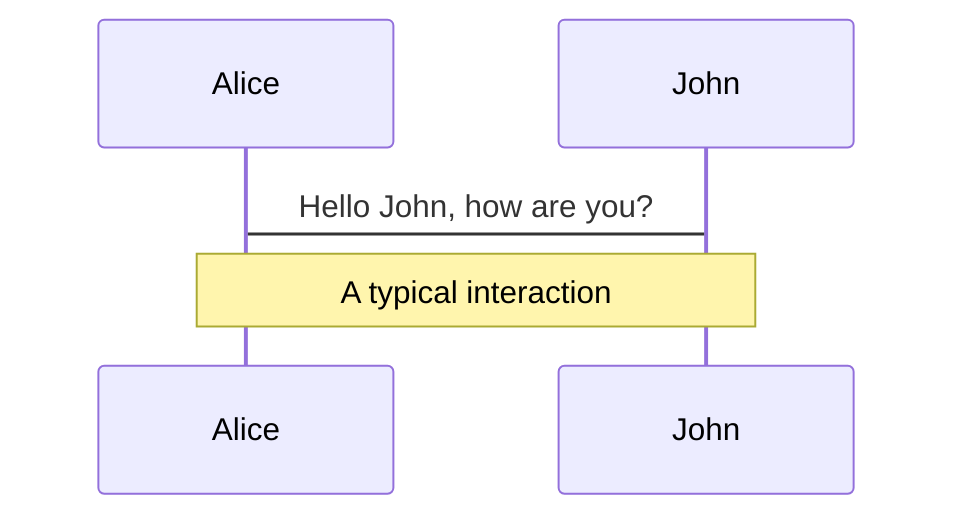
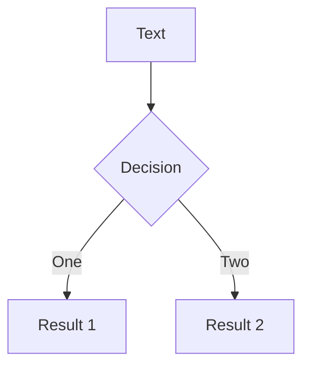
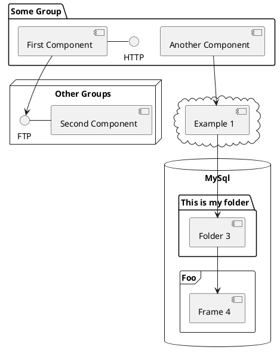

  <div class="leading-snug text-black dark:text-white text-opacity-60 dark:text-opacity-60 mt-4">
    <span class="text-9xl text-opacity-60" style="font-weight:600;" >
      LINUX
    </span> 
  </div>

<!--
The last comment block of each slide will be treated as slide notes. It will be visible and editable in Presenter Mode 
along with the slide. [Read more in the docs](https://sli.dev/guide/syntax.html#notes)
-->

---
layout: image-header-intro
imageRight: '/static/linux.png'
---
  <div class="text-primary dark:text-primary ">
    <span class="text-3xl" style="font-weight: 600;">
      Cos'è Linux
    </span>
  </div>

  <div class="flex justify-between pb-2">
    <span class="text-xs opacity-60">
      Linux è un sistema operativo <strong>Unix Like</strong>, ideato da Linus Torvlads nel 1991.
    </span>
  </div>

  <div class="flex justify-between pb-2">
    <span class="text-xs opacity-60">
      Linux è una reale alternativa al mondo Microsoft e Unix, presente in milioni di dispositivi e server, utilizzato 
      da migliaia di sviluppatori in un mercato in continua espansione.
    </span>
  </div>

  <div class="flex justify-between pb-2">
    <span class="text-xs opacity-60">
      Linux è oggi utilizzato in sistemi integrati, per il controllo di dispositivi robotici e sullo shuttle: 
      praticamente gira su oggetti elettronici di tutti i tipi, dai server agli smartphone, risultando il sistema
      operativo in assoluto più utilizzato.
    </span>
  </div>

  <div class="flex justify-between pb-2">
    <span class="text-xs opacity-60">
      Con Linux viene gestita la maggior parte di Internet, le più grandi piazze finanziarie del mondo, nonchè i 
      supercomputer che permettono le scoperte scientifiche.
    </span>
  </div>

---
layout: dynamic-image
image: 'static/Linus_Torvalds.jpg'
equals: false
---

<div class="text-primary dark:text-primary ">
  <span class="text-3xl" style="font-weight: 600;">
    Accenni di Storia
  </span>
</div>

<div class="text-secondary dark:text-primary pt-2">
  <span class="text-lg" style="font-weight: 400;">
    Linus Torvalds e la nascita di Linux
  </span>
</div>

<div class="flex justify-between pb-2">
  <span class="text-xs opacity-60">
    Linus Torvalds, studente finlandese di informatica, il 25 agosto del 1991, insoddisfatto del sistema operativo 
    Minix (sistema unix-like destinato alla didattica e che mal supportava la nuova architettura i386 a 32bit), decide 
    di creare un kernel unix con lo scopo di divertirsi e studiare il funzionamento del suo computer, un 80386.
  </span>
</div>

<div class="flex justify-between pb-2">
  <span class="text-xs opacity-60">
    All'inizio, il kernel programmato da Linus, chiamato Linux, aveva la necessità di girare all'interno dello 
    userspace di Minix. Questo implicava l'adesione alla licenza del Minix stesso, ovvero il libero utilizzo
    esclusivamente a fini didattici, impedendone la libera distribuzione.
    Linus decide quindi di sostituire quella parte del sistema operativo con il software del progetto GNU. Per fare ciò,
    Torvalds, cambiò la licenza e adottò la GPL.
  </span>
</div>

<div class="flex justify-between pb-2">
  <span class="text-xs opacity-60">
    Sin dalla versione 0.01 si poteva compilare e far partire la shell GNU Bash. Linus rende pubblico il suo lavoro ed
    il suo codice, trovando presto altri sviluppatori che aderiscono alla visione ed al progetto, rendendo in breve
    tempo linux un sistema operativo completo, pienamente funzionante e libero. Il 12 marzo del 1994, Linus Torvalds
    presenta all'Università di Helsinki la prima versione stabile di Linux, la 1.0.
  </span>
</div>

<!--
You can have `style` tag in markdown to override the style for the current page.
Learn more: https://sli.dev/guide/syntax#embedded-styles
-->

---
layout: image-header-intro
imageRight: '/static/gnu.png'
---
  <div class="text-primary dark:text-primary ">
    <span class="text-3xl" style="font-weight: 600;">
      Gnu Public License
    </span>
  </div>

  <div class="flex justify-between pb-2 pt-5">
    <span class="text-xs opacity-60">
      Linus Torvalds racconta nel suo libro che linux nasce per poter dare un'alternativa libera al predominio dei 
      software propretari. Adotta quindi una licenza il cui scopo principale è mantenere tale libertà. 
    </span>
  </div>

  <div class="flex justify-between pb-2 pt-5">
    <span class="text-xs opacity-60">
      La <strong>GPL</strong> sancisce che qualiasi fornitore, al momento di distribuire file binari, deve anche rendere
      il codice sorgente leggibile e disponibile sotto gli stessi termini di licenza.<br/>
      Essa garantisce agli utenti finali, come organizzazioni, imprese o semplici individui, di utilizzare, condividere 
      e persino modificare il software.
    </span>
  </div>

  <div class="flex justify-between pb-2 pt-5">
    <span class="text-xs opacity-60">
      Oggi arrivata alla terza versione, è progettata per essere applicata facilmente ai programmi di cui detengono i
      relativi diritti.
    </span>
  </div>

---
layout: center-image
equals: false
---

<div class="text-primary dark:text-primary pb-4">
  <span class="text-3xl" style="font-weight: 600;">
    Ma cos'è nella pratica
  </span>
</div>

<div class="text-left ml-20 mr-20 pb-2 opacity-60">
  <div class="pb-4">
      Possiamo definirlo impropriamente un sistema operativo che, come i suoi principali competitor, Windows e Mac OSX,
      permette al software applicativo di dialogare con l'hardware e gestirne le risorse.<br/>
      Senza il sistema operativo, il software non potrebbe funzionare.
  </div>

  <div class="pb-2">
      Il Sistema Operativo è composto da un certo numero di sottosistemi:
    <ul class="ml-3 pt-2">
      <li>- il <strong>Bootloader</strong> che è il software che gestisce il processo di avvio del computer</li>
      <li>
        - il <strong>Kernel</strong> che è il cuore del sistema e si occupa di gestire le risorse presenti nel
        computer, rendendole disponibili alle applicazioni
      </li>
      <li>
        - i <strong>Demoni</strong> che sono i vari servizi che ascoltano in backgroud e si attivano all'avvio del
        computer o in seguito a specifici eventi
      </li>
      <li>
        - la <strong>Shell</strong>, ovvero un software che emula un terminale a caratteri che permette di
        controllare il computer
      </li>
      <li>
        - il <strong>Server Grafico</strong> a cui è delegata la responsabilità di visualizzare le informazioni sul 
        monitor
      </li>
      <li>
        - l'<strong>Ambiente Desktop</strong>, ovvero il sottosistema con cui l'utente interagisce con il sistema 
        operativo
      </li>
    </ul>
  </div>
</div>

---
layout: center-image
equals: false
---

<div class="text-primary dark:text-primary pb-4">
  <span class="text-3xl" style="font-weight: 600;">
    Le Distribuzioni
  </span>
</div>

<div class="text-left ml-20 mr-20 pb-2 opacity-60">
  <div class="pb-4">
      Una distribuzione è un confezionamento di vari paccehtti software coerenti fra loro atto a rendere comoda e
      semplice, tramite procedure guidate, l'installazione di linux.
  </div>

  <div class="pb-2">
    Tenendo a mente che:
    <ul class="ml-3 pt-2">
      <li>- linux è solo un kernel, non un vero e proprio sistema operativo</li>
      <li>
        - le applicazioni eseguite all'interno della user-space hanno una propria versione e sono indipendenti da linux
        stesso
      </li>
    </ul>
  </div>
  <div>
    Le distribuzioni aggiungono tutto il software necessario per avere un sistema operativo completo di software
    applicativi e di servizio, personalizzando le versioni degli stessi e organizzando al meglio la procedura di
    installazione.
  </div>
</div>

---
layout: center-image
equals: false
---

<div class="text-primary dark:text-primary pb-4">
  <span class="text-3xl" style="font-weight: 600;">
    Quale distribuzione utilizzeremo
  </span>
</div>

<div class="text-left ml-20 mr-20 pb-2 opacity-60">
  <div class="pb-4">
      Le distribuzioni oggi disponibili sono diverse decine, tutte valide a modo loro e che si differenziano tra esse
      per delle pecularietà come l'ambiente di lavoro a cui sono destinate
  </div>

  <div class="pb-2">
    In questo corso utilizzeremo <strong>Ubuntu 20.04 LTS</strong>, una delle distribuzioni più semplici da usare che, grazie
    proprio alla semplicità di utilizzo, risulta essere la più diffusa.
  </div>
  <div>
    Ubuntu nasce il 20 ottobre 2002 con l'obiettivo principale di portare linux alle masse. È una distribuzione
    fortemente pensata per essere efficiente ma allo stesso tempo semplice da utilizzare.
  </div>
  <div>
    Di proprietà di Canonical, Ubuntu si presta ad essere usata sia su workstation, che su server e infrastrutture 
    cloud.<br>
    Proprio da questi ultimi due settori, Canonical trae i propri profitti.
  </div>
</div>

---
layout: image-header-intro
imageRight: 'static/Installazione01.png'
---

<div class="text-primary dark:text-primary pb-4">
  <span class="text-3xl" style="font-weight: 600;">
    Installazione
  </span>
</div>

<div class="text-left pb-2 opacity-60 mr-6">
  <div class="pb-4">
      L'installazione avverrà tramite una procedura guidata, durante la quale ci verranno poste alcune domande.
  </div>

  <div class="pb-2">
    <span class="font-bold text-lg text-yellow-500">Attenzione</span> La procedura di installazione apporterà modifiche
    alla memoria del computer, riducendo lo spazio disponibile del sistema operativo già presente, se si intende
    mantenerlo, piuttosto che eliminando tutti i dati presenti in esso se si intende sosituirlo.<br>
    È quindi necessario prestare la dovuta attenzione prima di procedere e assicurarsi di avere una copia di backup dei
    propri dati.
  </div>
</div>

---
layout: center-image
---

<div class="text-primary dark:text-primary pb-4">
  <span class="text-3xl" style="font-weight: 600;">
    Installazione
  </span>
</div>

<div class="flex text-xs">
  <div class="mr-2" style="width: 14rem;">
    
    <div class="opacity-60 mt-4">
      Decidiamo se procedere con un'installazione minimale o completa e, soprattutto, se scaricare gli aggiornamenti
      durante l'installazione ed installare driver e software di terze parti.
    </div>
  </div>
  <div class="mr-2" style="width: 14rem;">
    
    <div class="opacity-60 mt-4">
      Decidiamo se cancellare il contenuto del disco o ricavare un po di spazio da quello libero.
    </div>
  </div>
  <div class="mr-2" style="width: 14rem;">
    
    <div class="opacity-60 mt-4">
      Inseriamo il nome utente che desideriamo utilizzare, il nome con cui il computer sarà riconosciuto all'interno 
      della rete e la password
    </div>
  </div>
</div>

---
layout: image-header-intro
imageRight: 'static/Desktop.jpg'
---

<div class="text-primary dark:text-primary pb-4">
  <span class="text-3xl" style="font-weight: 600;">
    Primo Avvio
  </span>
</div>

<div class="text-left pb-2 opacity-60 mr-6">
  <div class="pb-4">
      Terminata l'installazione, se non si sono verificati errori durante quest'ultima, ci troveremo dinanzi una
      schermata di accesso con evidenziato il nome utente che abbiamo scelto nella fase precedente.<br>
      Cliccandogli sopra, ci verrà richiesta la password (anch'essa scelta nella fase precedente) e ci troveremo
      nell'ambiente desktop predefinito di Ubuntu
  </div>

  <div class="pb-2">
    <span class="font-bold text-lg text-yellow-500">Attenzione</span> La procedura di installazione apporterà modifiche
    alla memoria del computer, riducendo lo spazio disponibile del sistema operativo già presente, se si intende
    mantenerlo, piuttosto che eliminando tutti i dati presenti in esso se si intende sosituirlo.<br>
    È quindi necessario prestare la dovuta attenzione prima di procedere e assicurarsi di avere una copia di backup dei
    propri dati.
  </div>
</div>

<arrow v-click="1" x1="600" y1="120" x2="510" y2="50" color="rgba(59, 130, 246, 0.5)" width="2" arrowSize="1" />

---
layout: image-right
image: https://source.unsplash.com/collection/94734566/1920x1080
---

# Code

Use code snippets and get the highlighting directly![^1]

```ts {all|2|1-6|9|all}
interface User {
  id: number
  firstName: string
  lastName: string
  role: string
}

function updateUser(id: number, update: User) {
  const user = getUser(id)
  const newUser = {...user, ...update}  
  saveUser(id, newUser)
}
```

<arrow v-click="3" x1="400" y1="420" x2="230" y2="330" color="#564" width="3" arrowSize="1" />

[^1]: [Learn More](https://sli.dev/guide/syntax.html#line-highlighting)

<style>
.footnotes-sep {
  @apply mt-20 opacity-10;
}
.footnotes {
  @apply text-sm opacity-75;
}
.footnote-backref {
  display: none;
}
</style>

---

# Components

<div grid="~ cols-2 gap-4">
<div>

You can use Vue components directly inside your slides.

We have provided a few built-in components like `<Tweet/>` and `<Youtube/>` that you can use directly. And adding your custom components is also super easy.

```html
<Counter :count="10" />
```

<!-- ./components/Counter.vue -->
<Counter :count="10" m="t-4" />

Check out [the guides](https://sli.dev/builtin/components.html) for more.

</div>
<div>

```html
<Tweet id="1390115482657726468" />
```

<Tweet id="1390115482657726468" scale="0.65" />

</div>
</div>


---
class: px-20
---

# Themes

Slidev comes with powerful theming support. Themes can provide styles, layouts, components, or even configurations for tools. Switching between themes by just **one edit** in your frontmatter:

<div grid="~ cols-2 gap-2" m="-t-2">

```yaml
---
theme: default
---
```

```yaml
---
theme: seriph
---
```


</div>

Read more about [How to use a theme](https://sli.dev/themes/use.html) and
check out the [Awesome Themes Gallery](https://sli.dev/themes/gallery.html).

---
preload: false
---

# Animations

Animations are powered by [@vueuse/motion](https://motion.vueuse.org/).

```html
<div
  v-motion
  :initial="{ x: -80 }"
  :enter="{ x: 0 }">
  Slidev
</div>
```

<div class="w-60 relative mt-6">
  <div class="relative w-40 h-40">
    
    
    
  </div>

  <div
    class="text-5xl absolute top-14 left-40 text-[#2B90B6] -z-1"
    v-motion
    :initial="{ x: -80, opacity: 0}"
    :enter="{ x: 0, opacity: 1, transition: { delay: 2000, duration: 1000 } }">
    Slidev
  </div>
</div>

<!-- vue script setup scripts can be directly used in markdown, and will only affects current page -->
<script setup lang="ts">
const final = {
  x: 0,
  y: 0,
  rotate: 0,
  scale: 1,
  transition: {
    type: 'spring',
    damping: 10,
    stiffness: 20,
    mass: 2
  }
}
</script>

<div
  v-motion
  :initial="{ x:35, y: 40, opacity: 0}"
  :enter="{ y: 0, opacity: 1, transition: { delay: 3500 } }">

[Learn More](https://sli.dev/guide/animations.html#motion)

</div>

---

# LaTeX

LaTeX is supported out-of-box powered by [KaTeX](https://katex.org/).

<br>

Inline $\sqrt{3x-1}+(1+x)^2$

Block
$$
\begin{array}{c}

\nabla \times \vec{\mathbf{B}} -\, \frac1c\, \frac{\partial\vec{\mathbf{E}}}{\partial t} &
= \frac{4\pi}{c}\vec{\mathbf{j}}    \nabla \cdot \vec{\mathbf{E}} & = 4 \pi \rho \\

\nabla \times \vec{\mathbf{E}}\, +\, \frac1c\, \frac{\partial\vec{\mathbf{B}}}{\partial t} & = \vec{\mathbf{0}} \\

\nabla \cdot \vec{\mathbf{B}} & = 0

\end{array}
$$

<br>

[Learn more](https://sli.dev/guide/syntax#latex)

---

# Diagrams

You can create diagrams / graphs from textual descriptions, directly in your Markdown.

<div class="grid grid-cols-3 gap-10 pt-4 -mb-6">







</div>

[Learn More](https://sli.dev/guide/syntax.html#diagrams)


---
layout: center
class: text-center
---

# Learn More

[Documentations](https://sli.dev) · [GitHub](https://github.com/slidevjs/slidev) · [Showcases](https://sli.dev/showcases.html)
